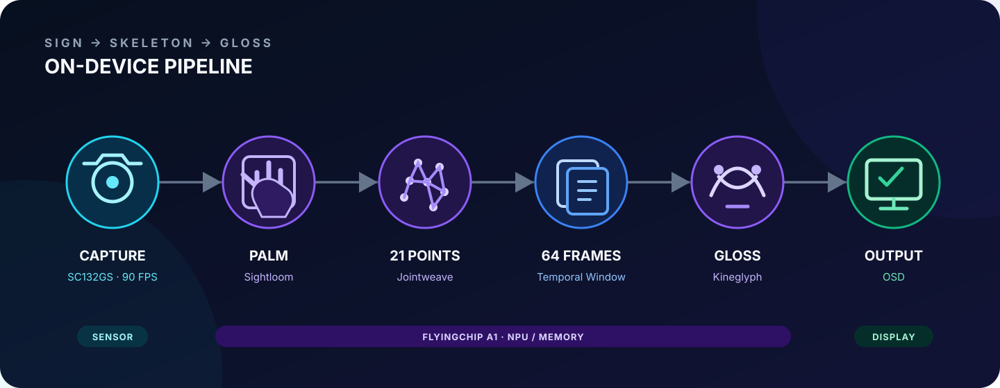

<div align="center">


<br />

[](#-系统架构) [](#-核心技术亮点) [](#-系统架构)

**面向机器人场景的高动态实时手语翻译与交互系统**

*“让涌动的情绪，找到表达的声音。”*

[项目简介](#-项目简介) · [系统架构](#-系统架构) · [模型家族](#-模型家族) · [核心技术亮点](#-核心技术亮点) · [快速开始](#-快速开始) · [目录结构](#-目录结构)

</div>

---

## ✦ I. 项目简介

**AetherSign（以太印记）** 是一套面向机器人高动态交互场景的端侧中文手语识别系统。系统以 **思特威 SC132GS 全局快门传感器** 为视觉入口，在仅有 **0.8 TOPS @ INT8** 算力的飞凌微 A1 Vision 平台上，完成从手掌定位、手部关键点提取到手语词（Gloss）分类的完整链路。

与依赖 RGB 视频和云端推理的常规方案不同，AetherSign 将连续图像尽早压缩为低维、可解释的骨骼特征，再通过轻量时空网络理解动作。配合灰度成像与红外补光，系统面向强光、暗光、纯黑和快速运动等复杂条件，为服务机器人、特种机器人与无障碍交互终端提供低延迟的“动作到语义”接口。

> 分赛区版本已将 **Palm Detector + Hand Landmarker + Gloss Translator** 三个模型全部部署至 A1 NPU，并打通板端孤立手语词识别链路。全国总决赛阶段正在重训三个模型，并扩展 Gloss Translator 的分类头与指令词表。

| 维度 | 当前系统 |
| :-- | :-- |
| 视觉输入 | SC132GS，1280 × 720，最高 90 FPS，全局快门灰度成像 |
| 边缘算力 | 飞凌微 A1 Vision，0.8 TOPS @ INT8 |
| 推理链路 | 手掌检测 → 21 点手部关键点 → 54 点时空特征 → Gloss 分类 |
| 板端模型 | Palm Detector → Hand Landmarker → Gloss Translator |
| 性能实测 | P95 延迟：`palm` ≈ 17.7 ms · `palm_hand` ≈ 60 ms · `fullcascade` ≈ 62 ms |
| 目标场景 | 机器人指令理解、无障碍交互、强光 / 暗光 / 红外环境 |

## ⬡ II. 系统架构

<p align="center">
  
</p>

AetherSign 采用 **Sign → Skeleton → Gloss** 的三级视觉压缩路径：SC132GS 捕获高速灰度帧，Palm Detector 定位手部，Hand Landmarker 提取每只手 21 个关键点，控制器维护 64 帧特征窗口，最后由 Gloss Translator 完成孤立词分类并通过 OSD 输出结果。

视觉模型在 A1 NPU 上级联运行；CPU 负责预后处理、坐标变换与特征缓存。`kInferInterval` 可调整推理间隔，Performance Monitor 则记录三种运行模式的 P95 延迟与分阶段耗时。

## ◈ III. 模型家族

为了让三个模型拥有统一、易记且与项目气质一致的身份，我们将它们命名为 **Eos · Iris · Muse**。三者取自古希腊神话，与 AetherSign 所承载的“以太”意象共同构成“看见、连接、表达”的完整叙事：

| 品牌名 | 技术名 | 职责 | 命名含义 |
| :-- | :-- | :-- | :-- |
| **AetherSign Eos** | Palm Detector | 从全帧中发现双手并生成候选框 | *Eos* 是希腊神话中的**黎明女神**；如第一缕微光划破黑暗，模型首先从灰度画面中发现并定位手掌，为后续链路指明方向 |
| **AetherSign Iris** | Hand Landmarker | 将手部 ROI 映射为 21 点骨骼拓扑 | *Iris* 是连接天地的**彩虹女神**与诸神信使；模型连接离散关键点，将像素编织成完整、可解释的手部几何结构 |
| **AetherSign Muse** | Gloss Translator | 从时空骨骼序列中识别 Gloss | *Muse* 是掌管诗歌、语言与灵感的**文艺女神**；模型为物理动作赋予语言与语义，将骨骼序列转化为人类可读的 Gloss |

代码和命令行继续使用 `palm`、`palm_hand`、`fullcascade` 等技术标识；新名称用于 README、演示界面和比赛展示，不改变现有接口。

## ⚡ IV. 核心技术亮点

## 🚀 V. 快速开始

### 5.1 前置条件

本仓库是项目代码、模型和文档的版本档案，**不能脱离厂商 SDK 独立编译**。开始前请准备：

- 飞凌微 A1 Vision 开发套件与思特威 SC132GS Sensor；
- `A1_SDK_SC132GS/smartsens_sdk` 编译环境；
- 厂商 SDK 头文件，尤其是 `ssne_api.h` 与 `osd_lib_api.h`；
- 板端模型与 OSD 资源文件。

当前最新板端版本位于 [`src/ssne_ai_demo/bak/half-final/`](./src/ssne_ai_demo/bak/half-final/)，完整参数说明见其 [README](./src/ssne_ai_demo/bak/half-final/README.md)。

### 5.2 集成至 A1 SDK

将 `half-final` 版本的代码放入 SDK 的应用目录：

```text
A1_SDK_SC132GS/
└── smartsens_sdk/
    └── smart_software/src/app_demo/slr_system/ssne_ai_demo/
```

确保运行资源按以下结构放置：

```text
app_assets/
├── colorLUT.sscl
└── models/
    ├── palm.m1model
    ├── hand.m1model
    └── slr5_fullcascade.m1model
```

Gloss 分类器应满足当前板端契约：

```text
INPUT0:  [1, 4, 54, 64]
OUTPUT0: [1, 5, 1, 1]
classes: 0=rain, 1=long, 2=short, 3=go, 4=thick
```

### 5.3 编译与烧录

在 SDK 根目录执行：

```bash
cd A1_SDK_SC132GS/smartsens_sdk/
./scripts/a1_sc132gs_build.sh
```

构建完成后，按照厂商工具链流程将镜像烧录至 A1 开发板。SDK 的日常增量编译、镜像位置与启动链路可参考 [`docs/sdk/quick_start.md`](./docs/sdk/quick_start.md)；容器环境见 [`docs/sdk/Docker容器与镜像编译.md`](./docs/sdk/Docker%E5%AE%B9%E5%99%A8%E4%B8%8E%E9%95%9C%E5%83%8F%E7%BC%96%E8%AF%91.md)。

### 5.4 板端运行

推荐使用启动脚本：

```sh
# 完整链路：Eos + Iris + Muse
./scripts/run.sh fullcascade

# 仅运行手掌检测
./scripts/run.sh palm

# 手掌检测 + 关键点定位
./scripts/run.sh palm_hand
```

也可以直接启动可执行文件：

```sh
./ssne_ai_demo --mode fullcascade --kInferInterval=1
```

| 模式 | 运行链路 | 适合场景 |
| :-- | :-- | :-- |
| `palm` | Eos | 手掌检测调试与性能基线 |
| `palm_hand` | Eos → Iris | 关键点精度与 OSD 骨骼显示 |
| `fullcascade` | Eos → Iris → Muse | 完整孤立手语词识别 |

常用调试方式：

```sh
# 每 2 帧执行一次 Palm + Hand 推理，仅显示手部关键点
./scripts/run.sh palm_hand --kInferInterval=2 --osd_mode=hand

# 关闭 OSD，测量完整链路推理性能
./ssne_ai_demo --mode fullcascade --osd_mode=none \
  --perf_monitor --perf_interval=30 --perf_sensor_fps=80

# 开启 Fullcascade 详细日志
./scripts/run.sh fullcascade \
  --fullcascade_verbose --fullcascade_debug_interval=30
```

`--osd_mode` 支持 `auto`、`all`、`hand`、`palm` 和 `none`；Performance Monitor 默认关闭，仅建议在性能分析时启用。

## 🗂 VI. 目录结构

```text
AetherSign/
├── README.md                         # 项目主页
├── docs/
│   ├── assets/                       # README 与答辩视觉素材
│   │   ├── aethersign-logo-minimal.svg
│   │   ├── aethersign-hero.svg
│   │   ├── aethersign-architecture.svg
│   │   └── figures/                  # 原始功能 / 调度 / 数据流与参考图
│   ├── project/
│   │   └── project-11.md             # 最新项目背景与进展
│   ├── problem/                      # 赛题说明与约束
│   ├── sdk/                          # A1 SDK、构建与模型转换文档
│   └── comp_mat/                     # 各阶段比赛提交材料
├── models/
│   ├── half_final/                   # 分赛区决赛模型归档
│   └── perminlary/                   # 初赛模型归档（历史目录名）
└── src/
    └── ssne_ai_demo/
        ├── README.md                 # 端侧程序版本索引
        └── bak/
            ├── half-final/           # 当前最新完整板端链路
            ├── preminilary/          # 初赛版本（历史目录名）
            └── vertical/             # 竖屏 / 方向实验版本
```

仓库以**比赛阶段归档**为主，因此历史目录名与版本快照会被保留；开发和复现时请优先从 `half-final` 版本开始。

## 🏁 VII. 全国总决赛阶段计划

- [x] Palm Detector、Hand Landmarker、Gloss Translator 全部完成 A1 NPU 部署
- [x] 打通 Camera → Skeleton → Gloss → OSD 的板端完整链路
- [x] 获得 2026 集创赛华东赛区一等奖并晋级全国总决赛
- [ ] 重训 Palm Detector，改善漏检与摄像距离依赖
- [ ] 重训 Hand Landmarker，重点扩充数据集多样性并缓解关键点塌缩
- [ ] 重训 Gloss Translator，增加分类头数量与孤立手语词规模
- [ ] 对照学术界 / 工业界 Baseline，继续优化精度、P95 延迟与可展示性
- [ ] 并行完成全国总决赛文档、PPT 与作品材料

## 👥 VIII. 团队信息

- **团队名称：** PeakDragonSoar（巅峰龙翔）
- **项目名称：** AetherSign（以太印记）
- **团队成员：** 3 名来自上海交通大学 2023 级微电子科学与工程专业的本科生

我们希望在有限算力与真实物理环境之间，找到一种更轻、更快、更可靠的人机沟通方式——让每一个动作，都能抵达它所表达的意义。
