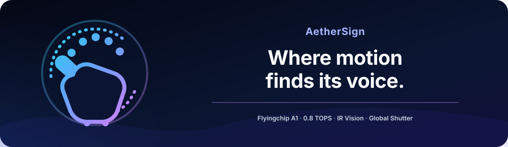
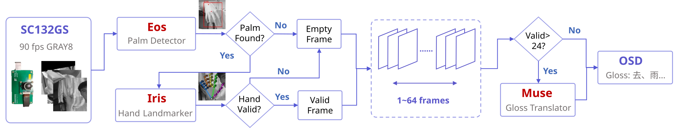
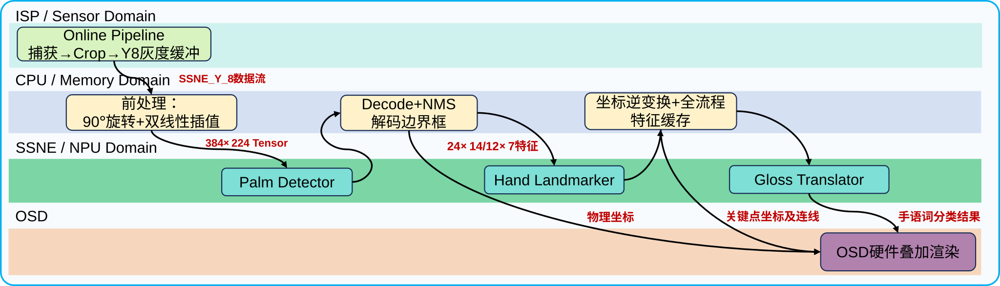
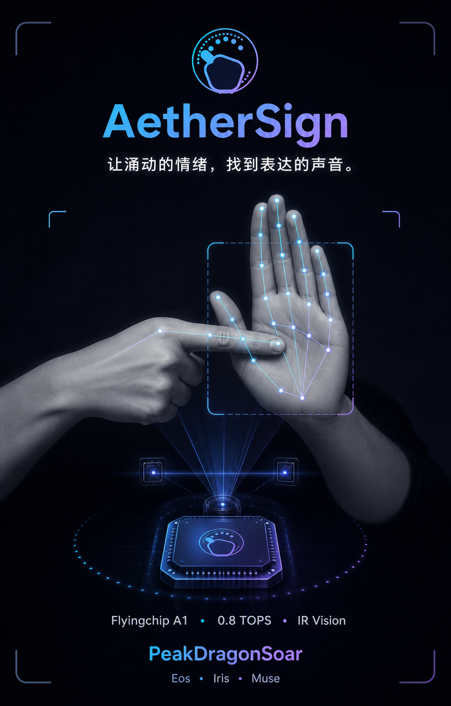
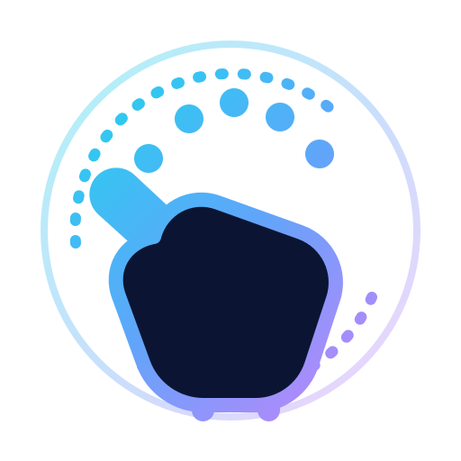

<h1 align="center">AetherSign</h1>

<div align="center">

[简体中文](./README.md) | **English**



<br />

[](#-ii-system-architecture) [](#-iii-model-family) [](#-ii-system-architecture)

**Real-time sign language recognition and interaction for high-dynamic robotic scenarios**

*“Let every stirring emotion find a voice.”*

[Overview](#-i-overview) · [System Architecture](#-ii-system-architecture) · [Model Family](#-iii-model-family) · [Quick Start](#-iv-quick-start) · [Repository Structure](#-v-repository-structure) · [Reproduction Guide](#-vi-reproduction-guide)

</div>

---

## ✦ I. Overview

**AetherSign** is an on-device Chinese Sign Language recognition system designed for high-dynamic robotic interaction. Using the **SmartSens SC132GS global-shutter sensor** as its visual input, it runs a complete pipeline—from palm localization and hand-landmark extraction to sign-language gloss classification—on the Flyingchip A1 Vision platform with only **0.8 TOPS @ INT8** of compute.

Unlike conventional approaches that rely on RGB video and cloud inference, AetherSign compresses consecutive images into low-dimensional, interpretable skeletal features as early as possible, then uses a lightweight spatiotemporal network to understand motion. Combined with monochrome imaging and infrared illumination, the system is designed for challenging conditions such as bright light, low light, complete darkness, and rapid movement, providing a low-latency “motion-to-meaning” interface for service robots, specialized robots, and accessible interaction terminals.

> [!NOTE]
> The final version deploys all three models—**Eos (Palm Detector), Iris (Hand Landmarker), and Muse (Gloss Translator)**—on the A1 NPU, completing an on-device isolated-sign recognition pipeline. In **Fullcascade mode**, the application currently runs at an average of approximately 19 FPS.

| Dimension | Current system |
| :-- | :-- |
| Visual input | SC132GS, 1280 × 720, up to 90 FPS, global-shutter monochrome imaging |
| Edge compute | Flyingchip A1 Vision, 0.8 TOPS @ INT8 |
| Inference pipeline | Palm detection → 21 hand landmarks → 54-point spatiotemporal features → gloss classification |
| On-device models | Palm Detector → Hand Landmarker → Gloss Translator |
| Measured performance | P95 latency: `palm` ≈ 36 ms · `palm_hand` ≈ 78 ms · `fullcascade` ≈ 78 ms |
| Target scenarios | Robot command understanding, accessible interaction, and bright-light / low-light / infrared environments |

For the final project overview, see [project-12.md](./docs/project/project-12.md) (Chinese).

---

## ⬡ II. System Architecture

<p align="center">
  
</p>

AetherSign follows a three-stage **Sign → Skeleton → Gloss** visual-compression pipeline. The SC132GS captures high-speed monochrome frames; **Eos** localizes the hands; **Iris** extracts 21 landmarks from each hand; the controller maintains a 64-frame feature window; and **Muse** performs isolated-sign classification before the result is rendered through the on-screen display (OSD).

The vision models run as a cascade on the A1 NPU, while the CPU handles pre-processing, post-processing, coordinate transforms, and feature buffering. The `mode` option selects the operating mode, `kInferInterval` adjusts the inference interval, and the Performance Monitor records P95 latency and stage-level timings for all three modes.

The **on-device data flow** is shown below:



---

## ◈ III. Model Family

To give the three models a consistent, memorable identity aligned with the character of the project, we named them **Eos · Iris · Muse**. Drawn from Greek mythology, the names complement the “aether” imagery behind AetherSign and form a complete narrative of “seeing, connecting, and expressing”:

| Brand name | Technical name | Role | Meaning |
| :-- | :-- | :-- | :-- |
| **AetherSign Eos** | Palm Detector | Finds both hands in the full frame and generates candidate boxes | *Eos*, goddess of the dawn, is the first light to break through darkness. Likewise, this model is the first to discover and localize palms in each monochrome frame, guiding the rest of the pipeline. |
| **AetherSign Iris** | Hand Landmarker | Maps each hand ROI to a 21-point skeletal topology | *Iris*, goddess of the rainbow and messenger of the gods, connects heaven and earth. Likewise, this model connects individual landmarks, weaving pixels into a complete and interpretable hand geometry. |
| **AetherSign Muse** | Gloss Translator | Recognizes glosses from spatiotemporal skeletal sequences | The *Muses* preside over poetry, language, and inspiration. Likewise, this model gives language and meaning to physical motion, converting skeletal sequences into human-readable glosses. |

The code and command line continue to use technical identifiers such as `palm`, `palm_hand`, and `fullcascade`. The new names are used in the README, demo interface, and competition presentation without changing existing interfaces.

Final model benchmarks and measured on-device application performance are provided below.

#### Eos Model Benchmark

<details><summary>Click to expand</summary>

Accuracy comparison between the final **Eos-2.1** model and two open-source hand-detection models on a custom dataset of 1,500 images at 1280 × 720:

| Model | Params | Mean IOU | Precision | Recall | AP@0.5 |
| --- | --- | --- | --- | --- | --- |
| **Eos-2.1 (final version)** | **1.368M** | 0.861 | 96.03% | **99.57%** | **98.92%** |
| HaGRIDv2 YOLOv10n Hand Detector | 2.720M | **0.912** | **99.34%** | 96.26% | 97.91% |
| 100DOH Faster R-CNN X101-FPN | 104.8M | 0.865 | 98.59% | 93.75% | 97.52% |

</details>

#### Iris Model Benchmark

<details><summary>Click to expand</summary>

Accuracy comparison between the final **Iris-2.0** models and several open-source hand-landmark models on a custom dataset of 402 hand ROI images:

| Model | Mean pixel error | P95 pixel error | Handedness Acc | Params | Latency on A1 |
|---|---|---|---|---|---|
| **AetherSign: Iris-2.0-lite** | 10.43 (↓52.5%) | 24.98 (↓54.6%) | 89.55% (↓2.4%) | **0.85M (↓55.5%)** | **≈20 ms** |
| **AetherSign: Iris-2.0-pro** | 10.14 (↓53.8%) | 23.77 (↓56.8%) | 81.59% (↓11.1%) | 1.91M | ≈22 ms |
| **AetherSign: Iris-2.0-max** | 9.71 (↓55.8%) | 23.26 (↓57.7%) | 98.26% (↑7.0%) | 1.91M | ≈22 ms |
| MediaPipe Hand TFLite | 7.46 | 20.95 | **99.00%** | 2.71M | N/A |
| RTMPose-m Hand5 | **6.37** | **18.76** | N/A | 13.76M | N/A |
| HaMeR-CVPR24 | 7.89 | 20.06 | N/A | 672M | N/A |
| Hamba-NeurIPS24 | 7.91 | 20.28 | N/A | 733M | N/A |
| **Iris-1.0 (regional-final baseline)** | 21.97 | 55.01 | 91.79% | 1.91M | ≈25 ms |

</details>

#### Measured On-Device Application Performance

<details><summary>Click to expand</summary>

The following results show the performance of the AetherSign real-time sign language recognition system on the target device.

| Mode | Valid test duration | Application FPS | R = FPSapp / 90 | Mean E2E | P95 E2E | FPS P5–P95 | Hand trigger rate |
| --- | --- | --- | --- | --- | --- | --- | --- |
| Palm | 98.4s | 27.38 | 0.304 | 36.48ms | 36.75ms | 27.21–27.59 | 0% |
| Palm+Hand | 65.8s | 14.77 | 0.164 | 67.69ms | 78.00ms | 12.82–27.59 | 93.1% |
| Fullcascade | 80.9s | 19.47 | 0.216 | 51.33ms | 78.00ms | 12.82–27.78 | 37.7% |

</details>

---

## 🚀 IV. Quick Start

### 4.1 Prerequisites

This repository is a version archive of the project's code, models, and documentation. It **cannot be built independently of the vendor SDK**. Before getting started, prepare:

- A Flyingchip A1 Vision development kit and SmartSens SC132GS sensor;
- The `A1_SDK_SC132GS/smartsens_sdk` build environment;
- Vendor SDK headers, especially `ssne_api.h` and `osd_lib_api.h`;
- On-device models and OSD resource files.

The latest on-device version is located in [`src/ssne_ai_demo/bak/final/`](./src/ssne_ai_demo/bak/final/). For a complete parameter reference, see its [README](./src/ssne_ai_demo/bak/final/README.md) (Chinese).

### 4.2 Integrate with the A1 SDK

Place the `final` version of the code in the SDK application directory:

```text
A1_SDK_SC132GS/
└── smartsens_sdk/
    └── smart_software/src/app_demo/slr_system/ssne_ai_demo/
```

Arrange the runtime resources as follows:

```text
app_assets/
├── colorLUT.sscl
├── osd_labels/
└── models/
    ├── palm.m1model
    ├── hand.m1model
    └── slr5_fullcascade.m1model
```

### 4.3 Build and Flash

Run the following command from the SDK root:

```bash
cd A1_SDK_SC132GS/smartsens_sdk/
./scripts/a1_sc132gs_build.sh
```

After the build completes, flash the image to the A1 development board using the vendor toolchain. For incremental builds, image locations, and the boot process, see [`docs/sdk/quick_start.md`](./docs/sdk/quick_start.md) (Chinese). For the container environment, see [`docs/sdk/Docker容器与镜像编译.md`](./docs/sdk/Docker容器与镜像编译.md) (Chinese).

### 4.4 Run on the Device

The startup script is recommended:

```sh
# Full pipeline: Eos + Iris + Muse
./scripts/run.sh --mode fullcascade

# Palm detection only
./scripts/run.sh --mode palm

# Palm detection + landmark localization
./scripts/run.sh --mode palm_hand
```

| Mode | Pipeline | Intended use |
| :-- | :-- | :-- |
| `palm` | Eos | Palm-detection debugging and performance baseline |
| `palm_hand` | Eos → Iris | Landmark accuracy and OSD skeleton visualization |
| `fullcascade` | Eos → Iris → Muse | Complete isolated-sign recognition |

For detailed commands, see [TERMINAL_COMMANDS.md](./src/ssne_ai_demo/bak/final/TERMINAL_COMMANDS.md) (Chinese).

---

## 🗂 V. Repository Structure

```text
AetherSign/
├── README.md                         # Chinese project homepage
├── README_EN.md                      # English project homepage
├── docs/
│   ├── assets/                       # Visual assets for the README and presentations
│   ├── project/                      # Latest project background and progress
│   ├── problem/                      # Competition problem statement
│   ├── sdk/                          # A1 SDK, build, and model-conversion documentation
│   └── comp_mat/                     # Competition submissions for each stage
├── models/
│   ├── half_final/                   # Regional-final model archive
│   └── perminlary/                   # Preliminary-stage model archive (historical directory name)
└── src/
    └── ssne_ai_demo/
        ├── README.md                 # On-device application version index
        └── bak/
            ├── final/                # Latest complete on-device pipeline
            ├── half-final/           # Regional-final version (historical directory name)
            ├── preminilary/          # Preliminary-stage version (historical directory name)
            └── vertical/             # Portrait-orientation experiments
```

The repository is primarily organized as an **archive of competition stages**, so historical directory names and version snapshots are intentionally preserved. For development and reproduction, begin with the `final` version.

The `src` directory in this repository contains only the on-device scheduling application. For the complete model-training code, see the [Reproduction Guide](#-vi-reproduction-guide) below.

---

## 🔬 VI. Reproduction Guide

The AetherSign models are trained and deployed in the order Eos → Iris → Muse. Training, evaluation, and inference code for each model lives in a separate repository with its own README documentation.

<table>
  <tr>
    <th>Component</th>
    <th>Repository</th>
    <th>Description</th>
    <th>Version</th>
  </tr>
  <tr>
    <td><strong>Eos (Palm Detector)</strong></td>
    <td><a href="https://github.com/sui-yu-x/Eos">https://github.com/sui-yu-x/Eos</a></td>
    <td>Eos model <strong>training and export</strong> system</td>
    <td>None</td>
  </tr>
  <tr>
    <td rowspan="3"><strong>Iris (Hand Landmarker)</strong></td>
    <td><a href="https://github.com/SmlCoke/HandLandmarksFab">https://github.com/SmlCoke/HandLandmarksFab</a></td>
    <td><strong>HLMF</strong>, the semi-automated dataset annotation system for Iris training</td>
    <td>HLMF-3.0-final</td>
  </tr>
  <tr>
    <td><a href="https://github.com/SmlCoke/HandClassifierFab">https://github.com/SmlCoke/HandClassifierFab</a></td>
    <td>The <strong>Hand Classifier</strong> auxiliary-model training and export system used by the Iris dataset pipeline</td>
    <td>HCF-1.0-final</td>
  </tr>
  <tr>
    <td><a href="https://github.com/SmlCoke/HandLandmarkerLab">https://github.com/SmlCoke/HandLandmarkerLab</a></td>
    <td><strong>HLML</strong>, the Iris model <strong>training system</strong></td>
    <td>HLML-4.0-final</td>
  </tr>
  <tr>
    <td><strong>Muse (Gloss Translator)</strong></td>
    <td><a href="https://github.com/zhangchengxiang316/Muse">https://github.com/zhangchengxiang316/Muse</a></td>
    <td>Muse model <strong>training and export</strong> system</td>
    <td>None</td>
  </tr>
</table>

> [!CAUTION]
> The **Hand Classifier (HCF)** is an auxiliary teacher model trained to provide handedness and hand-presence annotations for RTMPose/HaMeR. It is **not deployed as part of the final system**.

---

## 🏁 VII. Competition Journey

- [x] 2026-05-07: Preliminary stage completed
- [x] 2026-06-09: Qualified for the in-person regional final
- [x] 2026-07-24: East China regional final completed; won **First Prize in the East China region** 🏅
- [x] 2026-08-25: National final completed; won **First Prize in the national final** 🏆️

---

## 🙏 VIII. Acknowledgements

AetherSign would not have been possible without the support and efforts of numerous open-source projects, research teams, datasets, and individual contributors.

### 8.1 Open-Source Projects and Teacher Models

During the development of AetherSign, the following projects and models provided essential inspiration and support:

- [Google MediaPipe](https://github.com/google-ai-edge/mediapipe) — An important reference for the project's hand detection and landmark localization, as well as **our first teacher model**. It played a major role during the preliminary and regional-final stages.
- [RTMPose / MMPose](https://github.com/open-mmlab/mmpose) — Used as a teacher model when constructing the Hand Landmarker training dataset. RTMPose-m Hand5 achieved high accuracy on ordinary samples in the SC132GS domain, leading us to formally adopt a **semi-automated annotation strategy based on complementary teacher models and geometric-constraint filtering**.
- [HaMeR / CVPR24](https://github.com/geopavlakos/hamer) — Also used as a hand-landmark teacher model. HaMeR performed particularly well on difficult or occluded SC132GS-domain samples and generalized strongly, making it the **primary teacher model adopted for the national-final stage**.
- [Hamba / NeurIPS24](https://github.com/humansensinglab/Hamba) — Another hand-landmark model that provided important reference data for the Iris benchmark.
- [SSTCN / CVPR21Chal-SLR](https://github.com/jackyjsy/CVPR21Chal-SLR) — Provided important ideas for the design of our temporal-sequence modeling and isolated-sign classification pipeline.

> [!IMPORTANT]
> For the open-source licenses and citation requirements of these projects, consult their respective repositories and academic publications.

### 8.2 Datasets

We are especially grateful to the Visual Sign Language Research Group (VSLRG) at the University of Science and Technology of China (USTC) for granting us access to the following Chinese Sign Language datasets:

- **SLR500**: A Chinese isolated-sign dataset. Access: [https://ustc-slr.github.io/datasets/2015_csl/](https://ustc-slr.github.io/datasets/2015_csl/)
- **CSL-Daily**: A Chinese continuous-sign dataset. Access: [https://ustc-slr.github.io/datasets/2021_csl_daily/](https://ustc-slr.github.io/datasets/2021_csl_daily/)

The following projects and open datasets also made important contributions to our early exploration of continuous sign language recognition:

- **RWTH-BOSTON-104**: An American Sign Language continuous-sign dataset. Access: [https://www-i6.informatik.rwth-aachen.de/web/Software/Databases/Signlanguage/details/rwth-boston-104/index.php](https://www-i6.informatik.rwth-aachen.de/web/Software/Databases/Signlanguage/details/rwth-boston-104/index.php)
- **How2Sign-dwpose**: Skeletal-keypoint data derived from a subset of the official How2Sign dataset. Access: [https://huggingface.co/datasets/FangSen9000/How2Sign-dwpose](https://huggingface.co/datasets/FangSen9000/How2Sign-dwpose)
- **B-F-H 2D KeyPoints**: A subset of the How2Sign dataset. Access: [https://how2sign.github.io/#download](https://how2sign.github.io/#download)
- **MS-ASL**: An American Sign Language isolated-sign dataset from Microsoft Research. Access: [https://www.microsoft.com/en-us/research/project/ms-asl/](https://www.microsoft.com/en-us/research/project/ms-asl/)
- **WLASL**: An American Sign Language isolated-sign dataset from the Australian National University. Access: [https://dxli94.github.io/WLASL/](https://dxli94.github.io/WLASL/)
- **CE-CSL**: A Chinese continuous-sign dataset from the College of Intelligent Systems Science and Engineering at Harbin Engineering University. Access: [https://arxiv.org/abs/2409.11960](https://arxiv.org/abs/2409.11960)

> [!IMPORTANT]
> These datasets must be used in accordance with their respective release agreements.
> AetherSign **does not** redistribute the original datasets.
> To obtain the data, visit the official dataset pages and comply strictly with their terms of use.

### 8.3 Contributors

AetherSign was developed by **Team PeakDragonSoar**.

- **Team:** PeakDragonSoar
- **Project:** AetherSign
- **Members:** Three undergraduate students from the 2023 cohort of Microelectronics Science and Engineering at Shanghai Jiao Tong University (SJTU):
    - [@SmlCoke](https://github.com/SmlCoke) — Responsible for building the **Iris hand-landmark model**, including the HLMF system, HLML system, and HCF training.
    - [@sui-yu-x](https://github.com/sui-yu-x) — Responsible for building the **Eos hand-detection model**.
    - [@zhangchengxiang316](https://github.com/zhangchengxiang316) — Responsible for building the **Muse isolated-sign classification model** and integrating the on-device scheduling application.

We thank every team member whose hard work across the development, deployment, performance optimization, and competition stages made AetherSign possible.



*Between limited compute and the physical world, we hope to find a lighter, faster, and more reliable path for human–machine communication—so that every motion can reach the meaning it carries.*

<div align="center">



<sub>AetherSign · Eos → Iris → Muse · Final Archive</sub>

</div>
